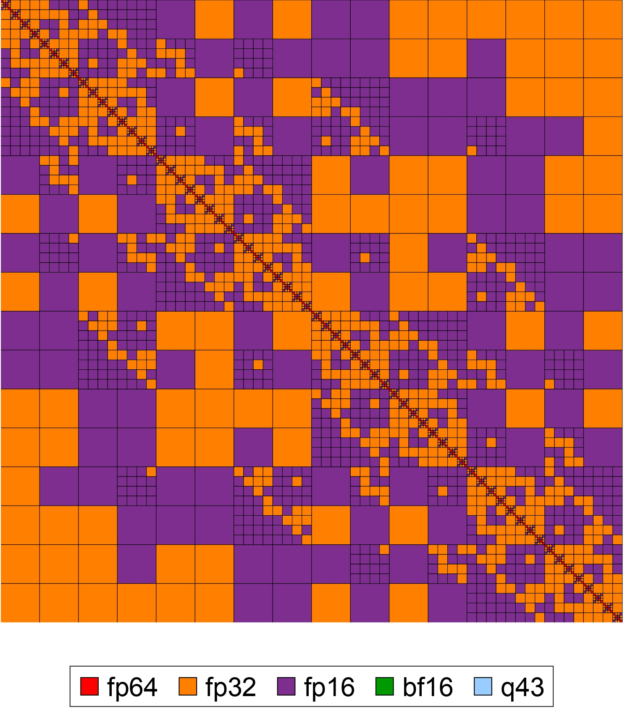
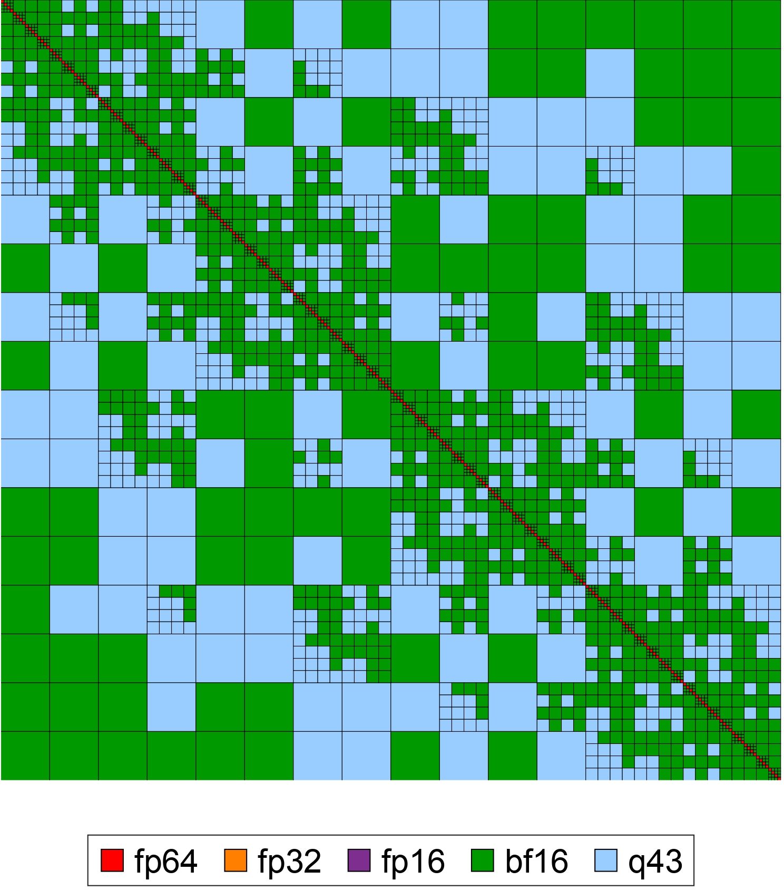

# Adaptive mixed-precision hybrid hierarchical matrices

Hybrid hierarchical matrices are based on a hybrid admissibility condition: the standard admissibility condition is used at the coarser level of the hierarchy, and the weak admissibility condition is used at the finer level of the hierarchy.

## Edit the following parameters based on your desired $\mathcal{H}$-matrix and kernel function.    
1) d_dim = The dimension of the space. The tree will be generated accordingly. For example, if d_dim=3, the resulting tree will be an oct-tree.
1) Nmax = The maximum number of particles at the leaf level (this decides the depth of the tree $L$).  
3) LR_epsilon = Prescribed accuracy in low-rank compression.
4) kernel_choice = Choice of your desired kernel function (see kernel_menu.md file and select the number from there).
5) hodlr_level = This decides the switching level (where the admissibility conditions will be switched). For example, if hodlr_level = 1, then switching level $\ell = L-1$.


## Please follow these simple steps to run the code.
Step 1.
```
git clone https://github.com/riteshkhan/ampHmat.git
```

<p align="center">
  <br>
  <em>
    <em>Figure 1: Target accuracy ε = 10⁻⁴</em>
  </em>
</p>

<br>

<p align="center">
  <br>
  <em>
    <em>Figure 2: Target accuracy ε = 10⁻²</em>
  </em>
</p>

## Acknowledgement 
This work is supported by the European Union (ERC, inEXASCALE, 101075632) and the Charles University Research Centre program No. UNCE/24/SCI/005. 
